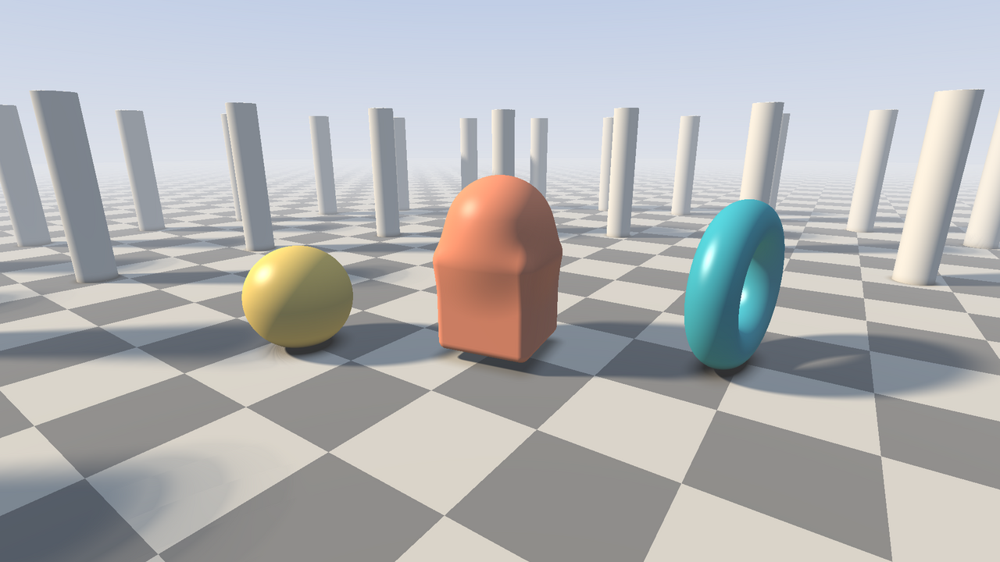
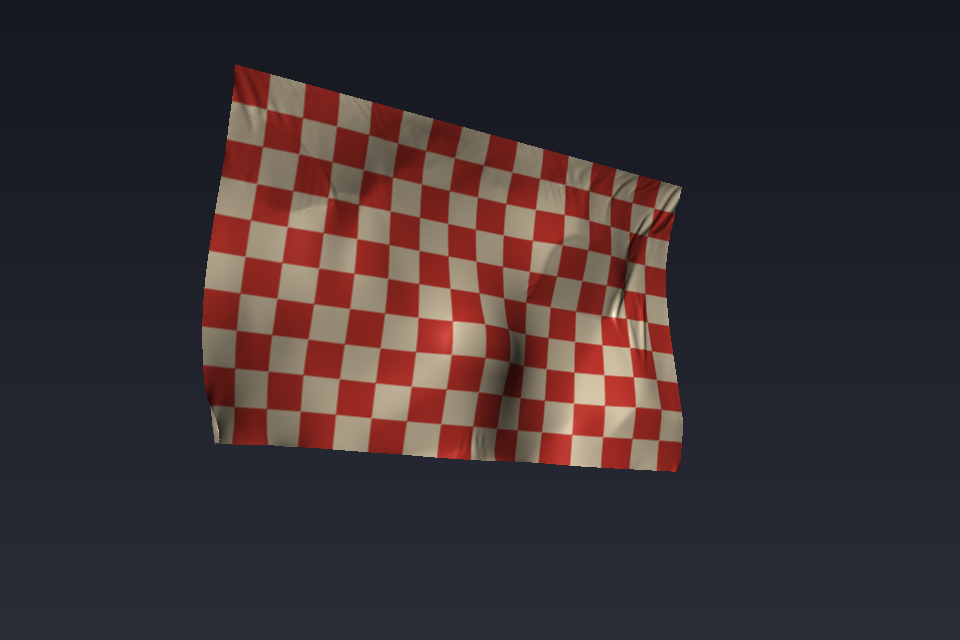
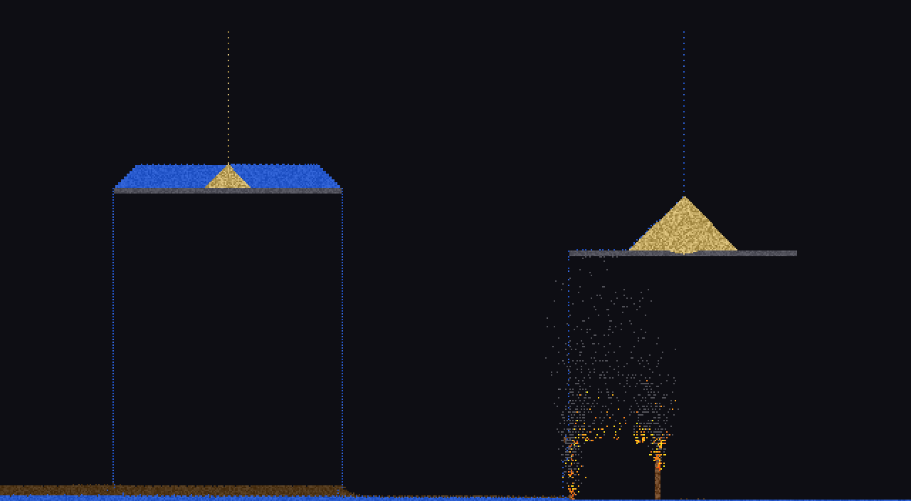
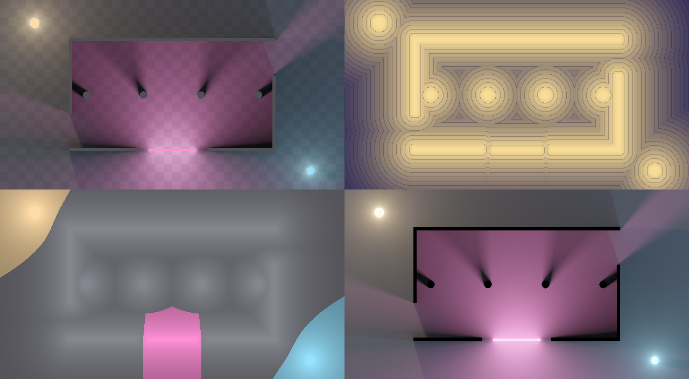
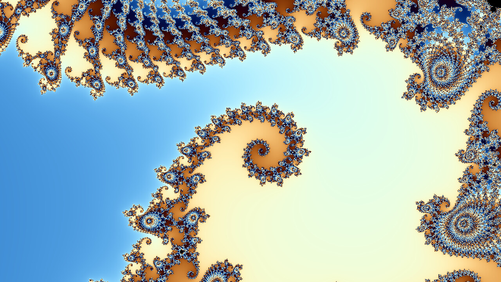
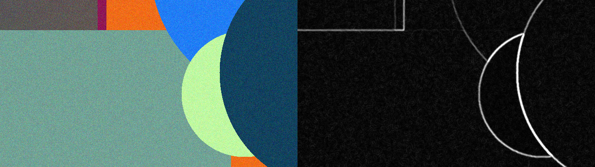
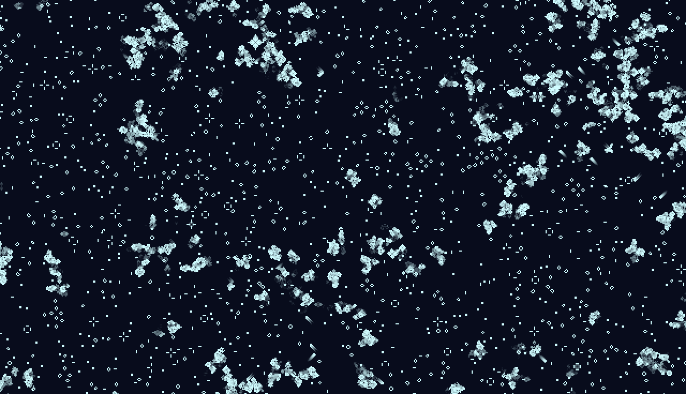

# rust-gpu-lab

Learning GPU programming in Rust with [cuTile Rust](https://github.com/NVlabs/cutile-rs),
NVIDIA's tile-based kernel DSL. Kernels are ordinary Rust functions that work on
fixed-size blocks ("tiles") of data. cuTile JIT compiles them through Tile IR
into CUDA kernels.



Each crate in this workspace is one demo (plus `tilekit`, a few shared host
helpers). Every demo includes:

- a CPU reference (rayon) with the same math, which checks the GPU output,
- a `bench` command comparing CPU and GPU times (and, from `life` on, the
  GPU replaying a CUDA graph),
- a README covering results, what the demo teaches, and the cuTile gotchas hit
  while building it.

## Demos

In the order they were built; each one builds on the lessons of the previous
ones. The crate READMEs number them in the order they were first planned, and
call this workspace by its working name, `tileworld`.

| crate                        | what it is                                                                 | CPU (rayon)       | GPU                 |
|------------------------------|----------------------------------------------------------------------------|-------------------|---------------------|
| [`mandelbrot`](mandelbrot)   | Escape-time Mandelbrot, with per-tile early exit                           | 48.7 ms           | 0.69 ms             |
| [`life`](life)               | Game of Life on a torus: a stencil kernel, CUDA graphs, a live window       | 4.1 ms / gen      | 0.33 ms / gen       |
| [`filters`](filters)         | Grayscale, Gaussian blur and Sobel edges as one bit-exact pipeline          | 11.7 ms           | 0.64 ms             |
| [`raymarch`](raymarch)       | Real-time SDF ray marcher with soft shadows, AO and fog, in one kernel      | 256 ms            | 4.1 ms              |
| [`light2d`](light2d)         | Jump flooding and 2D global illumination; paint walls and lights live       | 64 ms             | 1.25 ms             |
| [`sand`](sand)               | Falling sand: Margolus block automaton with fire, water, oil and smoke     | 6.7 ms            | 0.23 ms             |
| [`cloth`](cloth)             | Cloth in the wind over a sphere: position based dynamics, 102 launches/frame | 18.6 ms          | 0.91 ms             |

Sizes: mandelbrot 1920x1080 at 1000 iterations, life a 4096² world, filters a
3840x2160 frame, raymarch 1920x1080 at high quality, light2d a 640x352 world
at 32 rays per pixel (its CPU time covers the distance field and lighting, not
the final compose), sand a 640x352 world at 4 passes per frame, cloth
256x160 particles at 4 substeps x 2 iterations (its CPU time is with 8
threads; see its README). GPU times are the fastest path, eager or CUDA graph.
Measured on an RTX 4070 Ti SUPER and an i9-14900KF (28 threads) under WSL2.
See each crate's README for the full tables.

## Screenshots

**`cloth`**: a curtain of 256x160 particles after 240 frames of wind,
draped over the sphere.



**`sand`**: the demo scene after 300 frames. Sand and water taps, a pool
draining off a shelf, oil on the floor, and the wooden hut on fire.



**`light2d`**: the demo scene lit by three lights, then the same frame's
distance field, nearest surface (Voronoi) and raw radiance (left to right, top
to bottom).



**`mandelbrot`**: Seahorse Valley at 3000 iterations.



**`filters`**: a crop of the noisy 4K input and the edge map after two blur
passes, at full resolution.



**`life`**: part of the live window, enlarged 2x. Dying cells leave a short
cyan trail.



The `raymarch` image at the top is a 1920x1080 high-quality render, scaled
down.

## Requirements

- **An NVIDIA GPU** with compute capability 8.0 or newer (Ampere, Ada, Hopper,
  Blackwell).
- **CUDA Toolkit 13.2+** (13.3 recommended), which provides the `tileiras`
  compiler cuTile uses.
- **Rust 1.89+** (stable).
- **Linux.** Tested on WSL2 with Ubuntu 24.04.
- **An X11 display** for the windowed demos (`life`, `raymarch`, `light2d`).
  On WSL2, WSLg provides one.

`.cargo/config.toml` points `CUDA_TOOLKIT_PATH` at `/usr/local/cuda-13.3`. If
your toolkit is elsewhere, edit that file or export `CUDA_TOOLKIT_PATH`; Cargo
doesn't override a variable that is already set.

cuTile is pinned to git rev `d92c160` in the workspace `Cargo.toml`. crates.io
lags behind the version the cuTile book documents, and the API still changes
often.

## Quick start

```sh
git clone https://github.com/phiat/rust-gpu-lab.git
cd rust-gpu-lab

cargo run --release -p mandelbrot -- render   # writes mandelbrot.png
cargo run --release -p light2d -- run         # paint lights and walls in a window
cargo run --release -p raymarch -- bench      # CPU vs GPU timings
cargo run --release -p <crate> -- --help      # every command and option
```

The first run of each demo JIT compiles its kernels. That takes under a second
for `mandelbrot` and about 30 s for `raymarch`. Compiled kernels are saved to
`~/.cache/cutile/kernels`, so later runs start in 0.3-4 s.

## Layout

Every crate follows the same shape:

```
<crate>/src/gpu.rs    tile kernels and the host code that launches them
<crate>/src/cpu.rs    the same math on the CPU, for checking and benchmarks
<crate>/src/main.rs   clap CLI: run / render / bench (and check)
<crate>/README.md     results, lessons, gotchas, ideas
tilekit/src/          shared: pinned transfer buffers, Submit trait, JIT cache switch
```

## What the demos teach

| topic                                                                        | where                  |
|------------------------------------------------------------------------------|------------------------|
| Thinking in tile programs instead of pixel threads; masking with `select`    | `mandelbrot`           |
| Per-tile early exit, and why the loop shape decides whether it pays off      | `mandelbrot`, `raymarch` |
| Stencils that read neighbors: view shift plus block offset, ghost tiles      | `life`, `light2d`      |
| "Valid" convolutions that need no block arithmetic at all                    | `filters`              |
| CUDA graphs: ping-pong buffers, no allocation, when they pay off             | `life`, `filters`, `light2d` |
| One `Submit` trait so the same pipeline runs eagerly or records a graph      | `filters`, `light2d`   |
| Pinned host buffers: transfers without per-frame allocation                  | `filters`, `tilekit`   |
| A whole shading pipeline in one kernel, with parameters in a device buffer   | `raymarch`             |
| Data-dependent reads through `unsafe` pointer gathers                        | `light2d`              |
| JIT costs: compile time, the disk cache, specialization on divisibility      | `raymarch`, `light2d`  |
| The generic tile shape type bug, and writing literal shapes to avoid it      | `filters`, `raymarch`  |
| Matching float kernels to the CPU (within 1/255, then exactly)               | `raymarch`, `light2d`  |
| Moving cells without conflicts: Margolus blocks, hashed randomness           | `sand`                 |
| Per-launch integers through a tensor view, so one kernel variant, not three  | `sand`                 |
| Fewer tile ops means faster compile *and* faster frames                      | `sand`                 |
| Coloring constraints into batches (red/black generalized); why it matters    | `cloth`                |
| Same-shaped views so one kernel serves every stencil direction               | `cloth`                |
| Where the tile model stops: rasterizing on the CPU                           | `cloth`                |

## Roadmap

Next up, in this order. All are grid-shaped, so the stencil, gather and CUDA
graph lessons carry over:

1. ~~**Falling sand**~~: done, see [`sand`](sand).
2. ~~**Cloth**~~: done, see [`cloth`](cloth). Soft bodies are in its ideas.
3. **Smoke and fluid** (stable fluids): advection as an interpolated gather, a
   20-40 pass pressure solve per frame, and `light2d`-style painted obstacles.
4. **Flow-field pathfinding with crowds**: a distance-to-goal field that
   respects walls, its gradient as a direction field, and thousands of agents
   that sample it.

Later:

5. **Terrain with hydraulic erosion**: procedural noise, grid-based erosion
   (water and sediment layers), and a heightfield ray marcher.
6. **Voxel world ray tracer**: a 3D block grid traced cell by cell, with
   sunlight shadows. 3D tensors, and a gather at every step.
7. **Post-processing stack** for `raymarch`: bloom, tone mapping, depth of
   field, FXAA. Kernels at different resolutions feeding each other in one
   graph.
8. **Boids with neighbor search**: flocking needs nearby agents, and the tile
   model has no scatter or sort. Try splatting agents into a density and
   velocity grid instead.

Also on the list: Gray-Scott reaction-diffusion, Lattice Boltzmann, an async
job server (axum) that queues GPU work, an MNIST MLP, embedding search, and a
kernel shootout against CUDA C++ and cuda-oxide.

## License

MIT, see [LICENSE](LICENSE).
